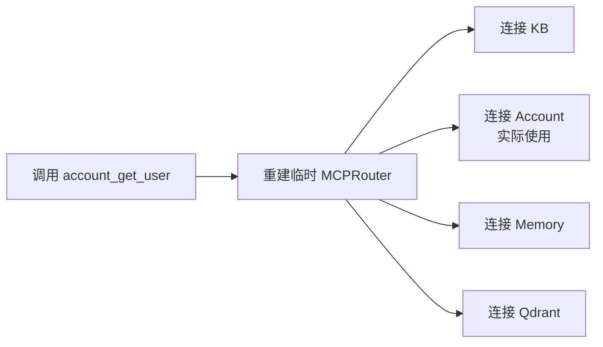
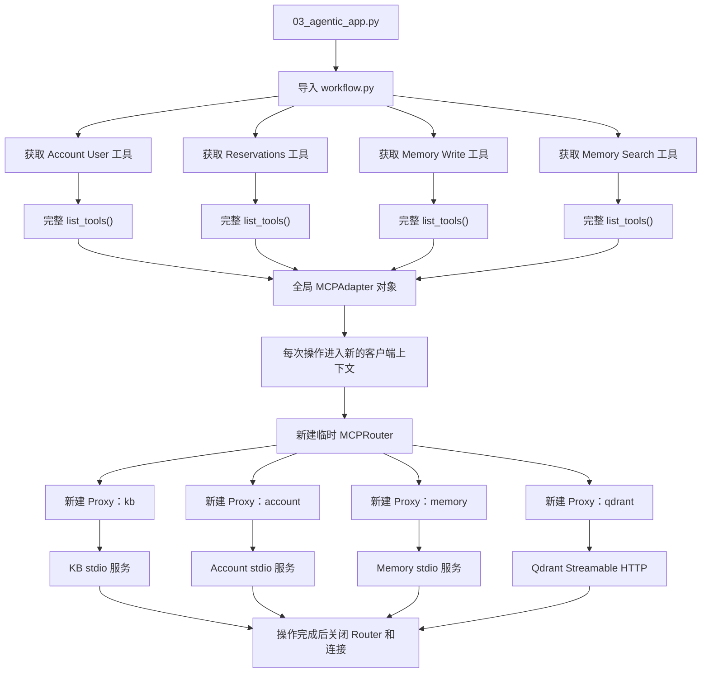
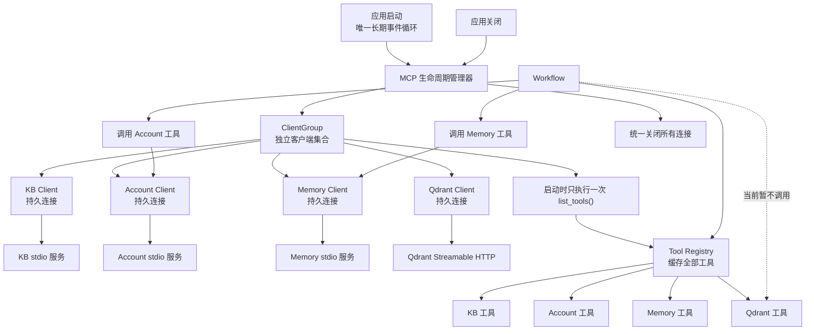
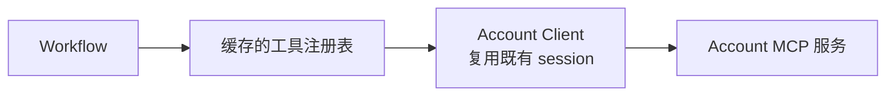

# MCP 生命周期管理问题记录

## 1. 问题背景

项目使用 `langchain.mcp.MCPAdapter` 统一接入以下 MCP 服务：

- Knowledge Base：stdio；
- Account：stdio；
- Memory：stdio；
- Qdrant：Streamable HTTP。

运行以下命令时：

```powershell
python 03_agentic_app.py --mode demo
```

终端会大量重复输出 FastMCP 日志：

```text
Proxy detected connected client - reusing existing session for all requests.
This may cause context mixing in concurrent scenarios...
```

这不是单纯的日志配置问题，而是当前 MCP 客户端生命周期和工具加载方式导致的重复建连现象。

### 1.1 问题本质

从业务使用视角看，本次改造的核心是解决 MCP 工具的生命周期管理问题，即统一管理工具的注册、发现、缓存、查询、路由和调用。

从基础设施视角看，工具管理依赖正确的 MCP Client 和连接生命周期，包括 Client 创建、服务连接、session 复用、并发隔离、断线重连以及应用关闭时的资源释放。

两者的关系可以概括为：

```text
MCP 生命周期管理
├── 工具生命周期
│   ├── 注册
│   ├── 发现
│   ├── 缓存
│   ├── 查询
│   ├── 路由
│   ├── 调用
│   └── 失效与刷新
│
└── 连接生命周期
    ├── Client 创建
    ├── 服务连接
    ├── session 复用
    ├── 并发隔离
    ├── 断线重连
    └── 应用关闭时释放
```

当前最明显的表象是工具管理不合理：

- 每获取一个工具，都重新发现全部工具；
- 没有统一的工具注册表；
- 已发现的工具没有集中缓存；
- 工具调用没有直接路由到所属 MCP Client；
- Qdrant 即使没有被使用，也参与每次连接。

其底层原因是连接生命周期没有和应用生命周期对齐：

```text
当前：
获取或调用一个工具
→ 创建全部 MCP 连接
→ 注册临时 Proxy
→ 执行操作
→ 关闭连接

理想：
应用启动
→ 创建并连接 MCP Clients
→ 一次性发现和注册工具
→ 缓存到 Tool Registry
→ 按需获取、直接路由并调用
→ 应用关闭时统一释放连接
```

因此，本次改造可以定义为：

> 建立应用级 MCP 工具管理机制，通过一次注册、统一缓存、按服务路由和连接复用，避免重复发现工具与重复建立全部 MCP 连接。

其中，“工具的注册、缓存和使用管理”是核心业务视角；“连接和 session 生命周期管理”是保证这套工具管理正确、高效运行的基础设施视角。

## 2. 当前实现

### 2.1 统一多服务配置

`agentic/tools/mcp_client.py` 使用一个全局 `MCPAdapter` 对象，并向其中传入包含四个服务的 `mcpServers` 配置。

```text
MCPAdapter
└── MCPConfigTransport
    └── 临时 MCPRouter
        ├── Proxy：kb      → KB stdio 服务
        ├── Proxy：account → Account stdio 服务
        ├── Proxy：memory  → Memory stdio 服务
        └── Proxy：qdrant  → Qdrant Streamable HTTP 服务
```

虽然 `_client` 缓存了 `MCPAdapter` 对象，但没有在应用生命周期内持续保持底层 MCP session。

因此：

```text
全局 MCPAdapter 对象一直存在
不等于
四个 MCP 连接一直存在
```

### 2.2 每次操作都会重建整个 Router

以下操作都会进入一次新的客户端上下文：

```python
client.list_tools()
tool.ainvoke(...)
```

FastMCP 在每次进入客户端上下文时，都会为多服务配置重新构建临时 `MCPRouter`，并为每个已配置服务创建一个 Proxy。

当前共有四个服务，因此一次工具发现或工具调用会产生四次 Proxy 提示：

```text
一次 list_tools() 或 tool.ainvoke()
× 四个 MCP 服务
= 四次 Proxy 提示
```

即使本次只调用 Account 工具，也会连接全部服务：



Qdrant 当前尚未接入 Resolver，但由于它已经包含在统一 `mcpServers` 配置中，每次构建 Router 时仍会被连接。

### 2.3 启动阶段重复发现工具

`agentic/workflow.py` 在模块导入阶段分别获取四个工具：

```python
ACCOUNT_GET_USER_TOOL = get_account_get_user_tool()
ACCOUNT_GET_RESERVATIONS_TOOL = get_account_get_user_reservations_tool()
MEMORY_WRITE_TOOL = get_memory_write_tool()
MEMORY_SEARCH_TOOL = get_memory_search_tool()
```

每个 getter 都会独立执行一次完整的 `client.list_tools()`，先获取四个服务的全部工具，再按服务名前缀筛选目标工具。

因此，应用尚未处理工单时就会产生：

| 操作 | 完整工具发现次数 | 每次 Proxy 提示数 | 提示总数 |
|---|---:|---:|---:|
| 获取 Account User 工具 | 1 | 4 | 4 |
| 获取 Reservations 工具 | 1 | 4 | 4 |
| 获取 Memory Write 工具 | 1 | 4 | 4 |
| 获取 Memory Search 工具 | 1 | 4 | 4 |
| 合计 | 4 | 4 | 16 |

### 2.4 Resolver 阶段的提示次数

一次正常 Resolver 执行包含以下 MCP 操作：

| 操作 | 客户端上下文次数 | Proxy 提示数 |
|---|---:|---:|
| 发现 KB 工具 | 1 | 4 |
| 调用 KB Search | 1 | 4 |
| 调用 Account User | 1 | 4 |
| 调用 Reservations | 1 | 4 |
| 调用 Memory Search | 1 | 4 |
| 小计 | 5 | 20 |
| 成功解决后调用 Memory Write | 1 | 额外 4 |

单次 Demo 的理论提示次数为：

```text
未进入 Resolver：
16 次

进入一次 Resolver，但没有写入 Memory：
16 + 20 = 36 次

进入一次 Resolver，并成功写入 Memory：
16 + 20 + 4 = 40 次
```

通用计算公式为：

```text
Proxy 提示数
= 16
+ Resolver 执行次数 × 20
+ Memory Write 次数 × 4
```

每条 FastMCP 提示本身包含多行文本，所以 40 条日志事件在终端中可能占据约 160 行。

## 3. 当前拓扑



## 4. 问题与风险

### 4.1 重复连接

每次工具发现和工具调用都会连接所有 MCP 服务，造成不必要的进程启动、HTTP 握手、session 初始化和资源释放。

### 4.2 工具发现重复

启动阶段为了获得四个具体工具，完整扫描了四次全部 MCP 工具。工具数量和服务数量增加后，初始化成本会继续放大。

### 4.3 无关服务参与调用

调用某一个服务的工具时，其他三个服务也会被连接。Qdrant 即使尚未被 Resolver 使用，也会参与每次 Router 构建。

### 4.4 并发上下文风险

FastMCP 明确提示复用已连接 Proxy client 可能在并发场景中造成 context mixing。当前单工单 Demo 主要表现为冗余连接和日志；未来并发处理多个工单时，需要认真处理 session 隔离。

### 4.5 多事件循环

同步 getter 通过 `asyncio.run()` 分别获取工具，导致启动阶段创建多个事件循环，不利于维护长生命周期的异步客户端和连接。

## 5. 理想连接方式

理想方案应遵循应用级生命周期管理：

1. 应用启动时创建一个长期运行的事件循环；
2. 为每个 MCP 服务创建独立客户端；
3. 使用 `ClientGroup` 管理这些客户端，而不是使用临时多服务 Proxy Router；
4. 应用启动时连接一次；
5. 只执行一次完整工具发现；
6. 将发现的工具缓存在 Tool Registry 中；
7. Workflow 从 Registry 获取工具，不再重复执行 `list_tools()`；
8. 工具调用直接路由到所属客户端，并复用其既有 session；
9. 应用关闭时统一释放所有 MCP 连接和 stdio 子进程。

## 6. 理想拓扑



理想情况下，调用 Account 工具只经过 Account 客户端：



不再执行以下无关连接：

```text
调用 Account
→ 同时连接 KB
→ 同时连接 Memory
→ 同时连接 Qdrant
```

## 7. 当前方式与理想方式对比

| 维度 | 当前方式 | 理想方式 |
|---|---|---|
| 客户端组织 | 一个多服务配置动态生成临时 Router | `ClientGroup` 管理独立客户端 |
| 连接生命周期 | 每次发现或调用时建立和关闭 | 应用启动连接、应用关闭释放 |
| 工具发现 | 每个 getter 重新发现全部工具 | 启动时统一发现一次 |
| 工具存储 | 临时返回后分别持有 | 缓存在统一 Tool Registry |
| 工具调用 | 每次连接全部四个服务 | 直接路由到工具所属服务 |
| Qdrant 行为 | 即使不使用也参与重连 | 未调用时不产生业务请求 |
| 事件循环 | 多次 `asyncio.run()` | 单一长期事件循环 |
| Proxy 提示 | 单次 Demo 约 36～40 条 | 避免多服务 Proxy 后通常不再出现 |
| 并发隔离 | 存在 session context mixing 警告 | 每个服务独立 client/session |

## 8. 后续改造建议

建议按以下顺序实施：

1. 将应用入口调整为单一异步生命周期，避免启动阶段多次 `asyncio.run()`；
2. 用独立 FastMCP Client 和 `ClientGroup` 替代 `mcpServers` 多服务临时 Router；
3. 在启动阶段一次性执行工具发现；
4. 建立 Tool Registry，按服务名和工具名索引工具；
5. 修改现有 `knowledge_client.py`、`account_client.py`、`memory_client.py` 和 `qdrant_client.py`，使其只从 Registry 获取工具；
6. 增加生命周期测试，验证每个服务只连接一次、工具发现只执行一次；
7. 增加并发测试，验证不同工单之间不会发生 MCP session 上下文混用；
8. 最后再将 Qdrant 工具接入 Resolver。

## 9. 验收标准

生命周期改造完成后，应满足：

- 应用启动阶段只执行一次完整工具发现；
- 获取多个具体工具不会重复调用 `list_tools()`；
- 调用 Account 工具不会连接或重建 Qdrant、KB、Memory 客户端；
- stdio MCP 子进程在应用运行期间保持稳定，不因每次调用重复启动；
- Qdrant Streamable HTTP session 在应用生命周期内按设计复用；
- 应用关闭时所有连接和子进程均被释放；
- 单工单和多工单并发场景均无 context mixing；
- 终端不再大量输出 `Proxy detected connected client` 提示。
