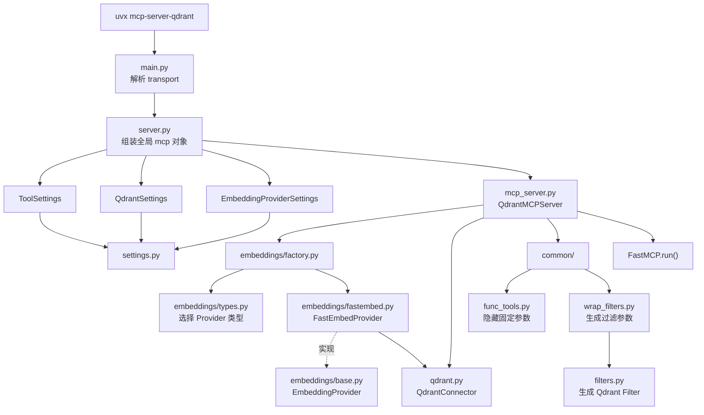
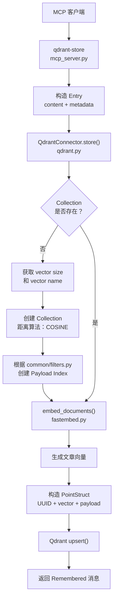
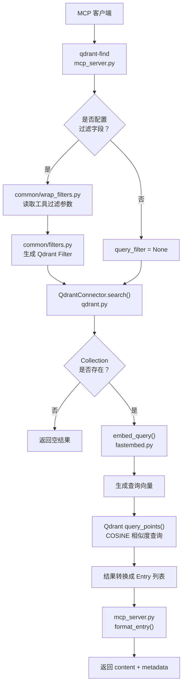
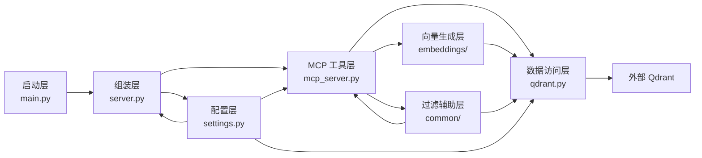
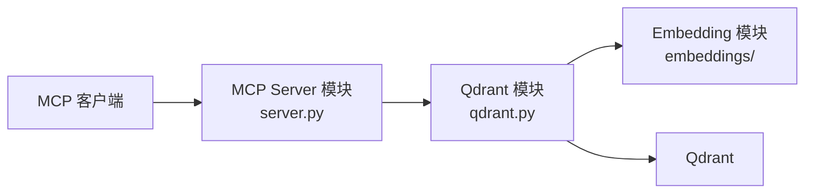

官方 GitHub：https://github.com/qdrant/mcp-server-qdrant

# Qdrant MCP 文件架构

本文按照文件结构与运行流程，说明官方 `mcp-server-qdrant` 项目中 `src/mcp_server_qdrant` 目录的职责划分与调用关系。

源码目录：https://github.com/qdrant/mcp-server-qdrant/tree/master/src/mcp_server_qdrant

## 1. 目录结构树

```text
src/mcp_server_qdrant/
│
├── __init__.py
│   └── Python 包标识，无业务逻辑
│
├── main.py                         【启动层】
│   ├── 解析 --transport
│   └── 启动 mcp.run()
│
├── server.py                       【组装层】
│   ├── 创建 ToolSettings
│   ├── 创建 QdrantSettings
│   ├── 创建 EmbeddingProviderSettings
│   └── 创建全局 QdrantMCPServer
│
├── settings.py                     【配置层】
│   ├── ToolSettings
│   ├── EmbeddingProviderSettings
│   ├── QdrantSettings
│   └── FilterableField
│
├── mcp_server.py                   【MCP 工具层】
│   ├── QdrantMCPServer
│   ├── 注册 qdrant-store
│   ├── 注册 qdrant-find
│   ├── 隐藏默认 Collection 参数
│   ├── 应用 metadata 过滤参数
│   └── 格式化检索结果
│
├── qdrant.py                       【数据访问层】
│   ├── Entry
│   └── QdrantConnector
│       ├── 初始化 AsyncQdrantClient
│       ├── 自动创建 Collection
│       ├── 创建 Payload Index
│       ├── store()
│       └── search()
│
├── embeddings/                     【向量生成层】
│   ├── __init__.py
│   ├── base.py
│   │   └── EmbeddingProvider 抽象接口
│   ├── types.py
│   │   └── EmbeddingProviderType
│   ├── factory.py
│   │   └── create_embedding_provider()
│   └── fastembed.py
│       └── FastEmbedProvider
│           ├── embed_documents()
│           ├── embed_query()
│           ├── get_vector_name()
│           └── get_vector_size()
│
└── common/                         【动态工具与过滤辅助层】
    ├── __init__.py
    ├── func_tools.py
    │   └── 固定并隐藏 MCP 工具参数
    ├── wrap_filters.py
    │   └── 将过滤字段转换成 MCP 工具参数
    └── filters.py
        ├── 生成 Qdrant Filter
        └── 生成 Payload Index 配置
```

## 2. 启动与依赖组装流程



## 3. `qdrant-store` 写入流程



## 4. `qdrant-find` 检索流程



## 5. 文件分层关系



## 6. 核心文件职责

| 文件或目录 | 所属层 | 主要职责 |
|---|---|---|
| `main.py` | 启动层 | 解析传输协议并启动 FastMCP |
| `server.py` | 组装层 | 创建配置对象并组装全局 `QdrantMCPServer` |
| `settings.py` | 配置层 | 定义工具、Embedding、Qdrant 和过滤字段配置 |
| `mcp_server.py` | MCP 工具层 | 注册并实现 `qdrant-store`、`qdrant-find` |
| `qdrant.py` | 数据访问层 | 管理 Qdrant Client、Collection、写入与搜索 |
| `embeddings/` | 向量生成层 | 定义并实现文本向量化能力 |
| `common/` | 辅助层 | 动态修改工具参数并生成 Qdrant Filter 和 Payload Index |

最核心的主调用链是：

```text
main.py
  → server.py
  → mcp_server.py
  → qdrant.py
  → Qdrant
```

其中：

- `embeddings/` 为 `qdrant.py` 提供文档向量和查询向量。
- `common/` 帮助 `mcp_server.py` 生成更适合 LLM 调用的工具参数和过滤条件。
- `settings.py` 为组装层、工具层和数据访问层提供配置。

## 7. 当前项目的架构决断：裁剪官方实现

### 7.1 决断

当前项目的 Qdrant MCP 参照官方 `mcp-server-qdrant` 实现，但不完整复制其模块划分。项目保留三个核心模块：

1. **MCP Server 模块**：负责服务启动、配置读取、MCP 工具注册和调用编排。
2. **Qdrant 模块**：负责 Qdrant Client、Collection、Dense 与 BM25 Sparse 写入，以及基于 RRF 的混合检索。
3. **Embedding 模块**：负责 Dense 文档向量化、Dense 查询向量化、向量名称和向量维数；BM25 Sparse Vector 优先由 Qdrant 内置 BM25 生成。

目标结构如下：

```text
qdrant_mcp/
├── server.py                 # MCP Server 模块
│   ├── 读取配置
│   ├── 注册知识检索工具
│   └── 编排工具调用与结果转换
│
├── qdrant.py                # Qdrant 模块
│   ├── 初始化 Qdrant Client
│   ├── 初始化 Dense + BM25 Sparse Collection
│   ├── 写入 Dense Vector 与 BM25 Sparse Vector
│   └── 执行 Dense + BM25 双路召回与 RRF 融合
│
└── embeddings/              # Embedding 模块
    ├── base.py              # Dense Embedding Provider 接口
    ├── factory.py           # Dense Provider 创建逻辑
    └── fastembed.py         # Dense FastEmbed 实现
```



### 7.2 保留与去除

| 官方模块或文件 | 当前项目决断 | 处理方式 |
|---|---|---|
| `mcp_server.py` | 保留能力 | 合并到 `server.py`，负责 MCP 工具注册与调用编排 |
| `server.py` | 保留 | 作为 MCP Server 模块的唯一入口 |
| `embeddings/` | 保留 | 保持独立，隔离具体 Embedding 实现 |
| `qdrant.py` | 保留 | 独立封装 Qdrant Client、Collection、写入与检索逻辑 |
| `settings.py` | 去除独立模块 | 当前项目所需的少量配置直接在 `server.py` 中读取和校验 |
| `common/` | 去除 | 不实现动态工具签名、任意过滤条件和 Payload Index 辅助逻辑 |
| `main.py` | 去除独立模块 | 由 `server.py` 直接提供启动入口 |
| `__init__.py` | 按 Python 包结构决定 | 只有在目录作为常规 Python 包时保留 |

### 7.3 去除的功能范围

当前项目暂不需要以下官方通用能力：

- 动态生成 MCP 过滤参数；
- 允许调用方传入任意 Qdrant Filter；
- 根据过滤字段自动创建 Payload Index；
- 在运行时选择多种 Embedding Provider；
- 同时支持“传入配置创建 Provider”和“直接注入 Provider”两种复杂初始化路径；
- 将启动、配置和工具注册继续拆分为多个独立文件。

### 7.4 必须保留的能力

模块裁剪不代表删除 Qdrant 的必要功能。裁剪后的三个模块仍必须共同实现：

| 能力 | 说明 |
|---|---|
| 配置读取 | `server.py` 读取 Qdrant 地址、API Key、Collection、Dense Embedding 模型、BM25 选项和搜索数量 |
| MCP 工具注册 | `server.py` 对 Agent 暴露当前项目需要的知识检索工具 |
| 调用编排与结果转换 | `server.py` 调用 Qdrant 模块，并将结果转换为当前工作流需要的文章结构 |
| Qdrant Client 初始化 | `qdrant.py` 创建并维护异步或同步 Qdrant Client |
| Collection 初始化 | `qdrant.py` 创建 Dense Named Vector 和带 IDF Modifier 的 BM25 Sparse Named Vector |
| 文档写入 | `qdrant.py` 同时写入 Dense Vector 和由 Qdrant 内置 BM25 生成的 Sparse Vector |
| 混合检索 | `qdrant.py` 通过 `prefetch` 并行执行 Dense 语义召回和 BM25 关键词召回，并用 RRF 融合结果 |

### 7.5 决断理由

| 理由 | 说明 |
|---|---|
| 召回信号互补 | Dense 处理同义表达和口语化问题，BM25 处理错误码、产品型号、政策名称等精确词语 |
| 降低接口复杂度 | Agent 只需要调用稳定的知识检索工具，不需要理解 Collection 和 Qdrant Filter |
| 遵循 YAGNI | 当前知识库体量较小，暂不引入 Cross-Encoder 或 ColBERT 精排，也不保留动态过滤、多 Provider 等未使用的扩展点 |
| 明确职责 | MCP 协议处理与 Qdrant 数据访问分离，避免 `server.py` 同时承担协议和存储细节 |
| 提高代码局部性 | Qdrant 连接、Collection、写入和检索集中在 `qdrant.py` 中 |
| 保留必要替换点 | Embedding 仍保持独立模块，未来更换模型时不必修改 MCP 工具流程 |

### 7.6 混合检索与重排决断

当前项目的知识检索统一采用 **Dense + BM25 混合检索**：

```text
查询文本
    ├── Dense 语义召回
    └── BM25 关键词召回
            ↓
         RRF 融合
            ↓
       返回最终 Top-K
```

具体决断如下：

| 能力 | 当前决断 | 说明 |
|---|---|---|
| Dense 检索 | 启用 | 处理同义词、口语化描述和语义相似问题 |
| BM25 检索 | 启用 | 使用 Qdrant 内置 BM25 生成 Sparse Vector，处理错误码、型号和精确业务术语 |
| 召回融合 | 启用 | 通过 Query API 的 `prefetch` 执行双路召回，使用 RRF 融合名次，避免直接混合不同尺度的分数 |
| Cross-Encoder 重排 | 暂不使用 | 需要在 Qdrant 之外接入和运行额外模型；当前知识库体量较小，还没有证据表明其精度收益高于延迟和部署成本 |
| ColBERT 重排 | 暂不使用 | Qdrant 原生支持 Multivector 存储、MaxSim 评分和多阶段查询，但 ColBERT 向量仍需由 Cloud Inference 或客户端模型生成；当前无需承担额外存储和计算成本 |

MCP 对 Agent 仍只暴露一个稳定的知识检索接口。Dense 召回、BM25 召回和 RRF 融合都封装在 `qdrant.py` 的实现内，不要分别暴露成多个 MCP 工具，也不要让 Agent 决定融合细节。

### 7.7 后续扩展条件

只有出现以下明确需求时，才重新拆出对应模块：

| 新需求 | 建议重新引入的模块 |
|---|---|
| 多租户、语言、产品等 metadata 过滤 | `common/` 或独立过滤模块 |
| 配置项显著增加或需要复杂校验 | 独立 `settings.py` |
| 支持多个 Embedding Provider | 扩展 `embeddings/factory.py` 与 Provider 类型定义 |
| 混合召回后的 Top-K 排序质量仍不足 | 先用评估集确认问题，再在 Cross-Encoder 与 ColBERT 中选择一种重排方案 |
| 支持多种启动传输和独立 CLI | 独立 `main.py` |

因此，当前项目采用的最终主调用链为：

```text
MCP Client
    → server.py
        → qdrant.py
            → embeddings/
            → Qdrant
```
